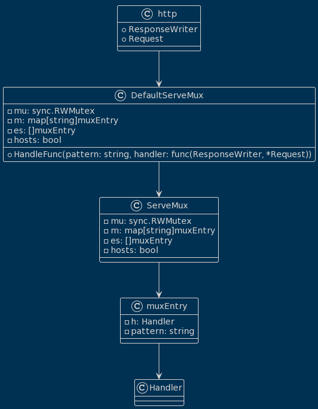
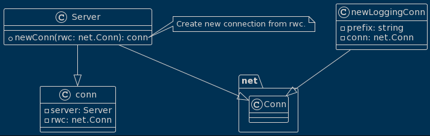
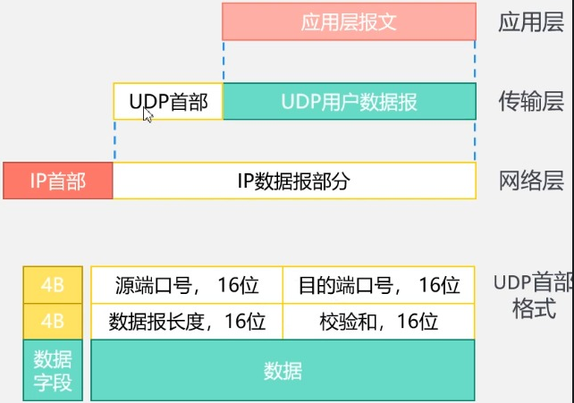

# Golang Gateway

## Http Server

### Introduction

3W means the combination of all websites.

| Acronym | Full Form                                        | Components            |
| ------- | ------------------------------------------------ | --------------------- |
| URL     | Uniform Resource Locator and includes a protocol | URL. = Protocol + URI |
| URI     | Uniform Resource Identifier                      |                       |

HTTP is **the Hypertext Transfer Protocol**.

| Acronym | Full Form                 |
| ------- | ------------------------- |
| HTML    | Hypertext Markup Language |
| CSS     | Hypertext Stylesheet      |
| JS      | Hypertext Functionality   |

communication between two host processes

 ```mermaid
 sequenceDiagram
     participant Client as Client
     participant Server as Server
 
     Client ->> Server: TCP connection
     Client ->> Server: HTTP request
     Server -->> Client: HTTP response
     Client -->> Server: TCP release
 
 ```

Every time there's a need to establish a connection and release it, how can this be resolved?

| Property              | Description                                                  |
| --------------------- | ------------------------------------------------------------ |
| Stateless             | A cookie is a small piece of data sent by a web server to the client's browser, where it is stored locally and then sent back with subsequent requests. Cookies are used to maintain state. |
| Persistent Connection | Keep-Alive allows a persistent connection to remain open for a certain period, |

requesting images


### Format message

HTTP messages, with the initiator being the Client, are in plain text ASCII format, consisting of 33 control characters and 95 regular characters.

|              | Client                                                    | Server                                                       |
| ------------ | --------------------------------------------------------- | ------------------------------------------------------------ |
| Start Line   | Method+URL+Version+CRLF                                   | Method+Status Code+Phrase+CRLF                               |
| Header Lines | Field Name+Value+CRLF<br />...<br />Field Name+Value+CRLF | Field Name+Value+CRLF<br />...<br />Field Name+Value+CRLF    |
| Blank Line   | CRLF                                                      | CRLF                                                         |
| Message Body |                                                           | Excluding images, videos, and other multimedia data,<br />it is transmitted using a data stream. |

The encoding of CRLF in the ASCII table is 13 10, and it is typically used to represent the line ending character in text files.

### Server code

````go
package main

import "net/http"

func main() {
	// HandleFunc registers a handler function for the "/hello" endpoint.
	http.HandleFunc("/hello", func(writer http.ResponseWriter, request *http.Request) {
		// Write a response back to the client with the message "hello, this is server".
		_, _ = writer.Write([]byte("hello, this is server"))
	})

	// ListenAndServe listens on the TCP network address 127.0.0.1:1234 for incoming connections.
	// It serves incoming HTTP requests using the registered handler, which in this case is the "/hello" endpoint.
	_ = http.ListenAndServe("127.0.0.1:8080", nil)
}
````

### Client code

```go
package main

import (
	"fmt"
	"io"
	"net/http"
)

func main() {
	// Create an HTTP client.
	client := &http.Client{}

	// Send an HTTP GET request to the specified URL.
	resp, err := client.Get("http://127.0.0.1:1234/hello")
	if err != nil {
		fmt.Println(err)
		return // Exit the function if there's an error.
	}
	defer resp.Body.Close() // Close the response body when we're done with it.

	// Read and store the entire response body.
	body, err := io.ReadAll(resp.Body)
	if err != nil {
		fmt.Println(err)
		return // Exit the function if there's an error.
	}

	// Print the contents of the response body as a string.
	fmt.Println(string(body))
}
```

### Match pattern

Matching Principles

The matching process involves comparing paths from long to short.

/ will eventually match all patterns. (/ 匹配所有的規則)

| Path         | Example      |
| ------------ | ------------ |
| /hello/world | /hello/world |
| /hello       | /hello       |
| /            | / ; /ho      |

### Server functions

#### HandlerFunc Type

```go
	http.HandleFunc("/hello", func(writer http.ResponseWriter, request *http.Request) {
		// Write a response back to the client with the message "hello, this is server".
		_, _ = writer.Write([]byte("hello, this is server"))
	})

👉 http.HandleFunc

func HandleFunc(pattern string, handler func(ResponseWriter, *Request)) {
	DefaultServeMux.HandleFunc(pattern, handler)
}

👉 DefaultServeMux.HandleFunc

// HandleFunc registers the handler function for the given pattern.
func (mux *ServeMux) HandleFunc(pattern string, handler func(ResponseWriter, *Request)) {
	if handler == nil {
		panic("http: nil handler")
	}
	mux.Handle(pattern, HandlerFunc(handler))
}

👉 HandlerFunc

// The HandlerFunc type is an adapter to allow the use of
// ordinary functions as HTTP handlers. If f is a function
// with the appropriate signature, HandlerFunc(f) is a
// Handler that calls f.
type HandlerFunc func(ResponseWriter, *Request)
```

UML diagram as follows

```dot
@startuml
!theme blueprint
class http {
    + HandleFunc(pattern: string, handler: func(ResponseWriter, *Request))
}

class DefaultServeMux {
    + HandleFunc(pattern: string, handler: func(ResponseWriter, *Request))
}

class ServeMux {
    + Handle(pattern: string, handler: Handler)
    + HandleFunc(pattern: string, handler: func(ResponseWriter, *Request))
}

class HandlerFunc {
    + ServeHTTP(writer: ResponseWriter, request: *Request)
}

interface ResponseWriter {
    + Write([]byte)
}

class Request

http -- DefaultServeMux
DefaultServeMux -- ServeMux
ServeMux -- HandlerFunc
HandlerFunc -- ResponseWriter
HandlerFunc -- Request
@enduml
```

 


#### ServeMux

```go
// HandleFunc registers a handler function for the "/hello" endpoint.
	http.HandleFunc("/hello", func(writer http.ResponseWriter, request *http.Request) {
		// Write a response back to the client with the message "hello, this is server".
		_, _ = writer.Write([]byte("hello, this is server"))
	})

👉 http.HandleFunc

// HandleFunc registers the handler function for the given pattern
// in the DefaultServeMux.
// The documentation for ServeMux explains how patterns are matched.
func HandleFunc(pattern string, handler func(ResponseWriter, *Request)) {
	DefaultServeMux.HandleFunc(pattern, handler)
}

👉 DefaultServeMux

// DefaultServeMux is the default ServeMux used by Serve.
var DefaultServeMux = &defaultServeMux

👉 ServeMux

// ServeMux also takes care of sanitizing the URL request path and the Host
// header, stripping the port number and redirecting any request containing . or
// .. elements or repeated slashes to an equivalent, cleaner URL.
type ServeMux struct {
	mu    sync.RWMutex
	m     map[string]muxEntry
	es    []muxEntry // slice of entries sorted from longest to shortest.
	hosts bool       // whether any patterns contain hostnames
}

type muxEntry struct {
	h       Handler
	pattern string
}
```

- There is a **map** that requires a **read-write lock**.

- The **muxEntry** structure contains **a pattern string**, which is later used to form a slice.
  This design allows **muxEntry** to have both **a map and a slice**.
  (切片里只有值没键无法运作)
- **[]muxEntry** will **be sorted** from long to short in order to match the pattern, so a slice will definitely be used. (有切片才能排序)
- The **hosts** determine whether the pattern includes a hostname, but its utility is limited and it **is rarely used**.

UML diagram as follows

```dot
@startuml
!theme blueprint
class http {
  + ResponseWriter
  + Request
}

class DefaultServeMux {
  - mu: sync.RWMutex
  - m: map[string]muxEntry
  - es: []muxEntry
  - hosts: bool
  + HandleFunc(pattern: string, handler: func(ResponseWriter, *Request))
}

class ServeMux {
  - mu: sync.RWMutex
  - m: map[string]muxEntry
  - es: []muxEntry
  - hosts: bool
}

class muxEntry {
  - h: Handler
  - pattern: string
}

http --> DefaultServeMux
DefaultServeMux --> ServeMux
ServeMux --> muxEntry
muxEntry --> Handler
@enduml
```

 

Handler refers to the response corresponding to the respective pattern.

#### ServeHTTP

 ```go
 // HandleFunc registers a handler function for the "/hello" endpoint.
 	http.HandleFunc("/hello", func(writer http.ResponseWriter, request *http.Request) {
 		// Write a response back to the client with the message "hello, this is server".
 		_, _ = writer.Write([]byte("hello, this is server"))
 	})
 
 👉 http.HandleFunc
 
 // HandleFunc registers the handler function for the given pattern
 // in the DefaultServeMux.
 // The documentation for ServeMux explains how patterns are matched.
 func HandleFunc(pattern string, handler func(ResponseWriter, *Request)) {
 	DefaultServeMux.HandleFunc(pattern, handler)
 }
 
 👉 DefaultServeMux.HandleFunc
 
 // HandleFunc registers the handler function for the given pattern.
 func (mux *ServeMux) HandleFunc(pattern string, handler func(ResponseWriter, *Request)) {
 	if handler == nil {
 		panic("http: nil handler")
 	}
 	mux.Handle(pattern, HandlerFunc(handler))
 }
 
 👉 HandlerFunc(handler)
 
 // The HandlerFunc type is an adapter to allow the use of
 // ordinary functions as HTTP handlers. If f is a function
 // with the appropriate signature, HandlerFunc(f) is a
 // Handler that calls f.
 type HandlerFunc func(ResponseWriter, *Request)
 
 // ServeHTTP calls f(w, r).
 func (f HandlerFunc) ServeHTTP(w ResponseWriter, r *Request) {
 	f(w, r)
 }
 
 👆 type HandlerFunc func(ResponseWriter, *Request)
 
 // If ServeHTTP panics, the server (the caller of ServeHTTP) assumes
 // that the effect of the panic was isolated to the active request.
 // It recovers the panic, logs a stack trace to the server error log,
 // and either closes the network connection or sends an HTTP/2
 // RST_STREAM, depending on the HTTP protocol. To abort a handler so
 // the client sees an interrupted response but the server doesn't log
 // an error, panic with the value ErrAbortHandler.
 type Handler interface {
 	ServeHTTP(ResponseWriter, *Request)
 }
 ```

- HandlerFunc(handler) is used for encapsulation, and after encapsulation, you can invoke the ServeHTTP function. (封装触发ServeHTTP)

UML diagram as follows

```dot
@startuml
!theme blueprint
class http.HandleFunc {
  + HandleFunc(pattern: string, handler: func(ResponseWriter, *Request))
}

class DefaultServeMux {
  + HandleFunc(pattern: string, handler: func(ResponseWriter, *Request))
}

class ServeMux {
  - handlers: map
  + Handle(pattern: string, handler: Handler)
  + HandleFunc(pattern: string, handler: func(ResponseWriter, *Request))
}

interface Handler {
  + ServeHTTP(ResponseWriter, *Request)
}

class HandlerFunc {
  - f: func(ResponseWriter, *Request)
  + ServeHTTP(ResponseWriter, *Request)
}

http.HandleFunc --> DefaultServeMux.HandleFunc : delegates to
DefaultServeMux.HandleFunc --> ServeMux : delegates to
ServeMux ..|> Handler : implements
HandlerFunc --> Handler : implements
HandlerFunc --> ServeMux : delegates to
HandlerFunc --> DefaultServeMux : delegates to
@enduml
```


This is a bit complex. **ServeMux** has the **HandleFunc** function, so it can be converted into the **HandlerFunc** type. The **HandlerFunc** type is by default using **DefaultServeMux** to store path data. The **HandlerFunc** type can implement the **Handler** interface, so **ServeMux** indirectly implements the **Handler** interface.

这有点复杂。**ServeMux** 有 **HandleFunc** 函数，所以它可以转换为 **HandlerFunc** 类型。**HandlerFunc** 类型默认使用 **DefaultServeMux** 存储路径数据。**HandlerFunc** 类型可以实现 **Handler** 接口，因此 **ServeMux** 间接实现了 **Handler** 接口。

#### Handle Function

```go
// DefaultServeMux is the default ServeMux used by Serve.
var DefaultServeMux = &defaultServeMux

var defaultServeMux ServeMux

// HandleFunc registers a handler function for the "/hello" endpoint.
	http.HandleFunc("/hello", func(writer http.ResponseWriter, request *http.Request) {
		// Write a response back to the client with the message "hello, this is server".
		_, _ = writer.Write([]byte("hello, this is server"))
	})

👉 http.HandleFunc

// HandleFunc registers the handler function for the given pattern
// in the DefaultServeMux.
// The documentation for ServeMux explains how patterns are matched.
func HandleFunc(pattern string, handler func(ResponseWriter, *Request)) {
	DefaultServeMux.HandleFunc(pattern, handler)
}

👉 DefaultServeMux.HandleFunc

// HandleFunc registers the handler function for the given pattern.
func (mux *ServeMux) HandleFunc(pattern string, handler func(ResponseWriter, *Request)) {
	if handler == nil {
		panic("http: nil handler")
	}
	mux.Handle(pattern, HandlerFunc(handler))
}

👉 mux.Handle

// Handle registers the handler for the given pattern.
// If a handler already exists for pattern, Handle panics.
func (mux *ServeMux) Handle(pattern string, handler Handler) {
	mux.mu.Lock()
	defer mux.mu.Unlock()

	if pattern == "" {
		panic("http: invalid pattern")
	}
	if handler == nil {
		panic("http: nil handler")
	}
	if _, exist := mux.m[pattern]; exist {
		panic("http: multiple registrations for " + pattern)
	}

	if mux.m == nil {
		mux.m = make(map[string]muxEntry)
	}
	e := muxEntry{h: handler, pattern: pattern}
	mux.m[pattern] = e
	if pattern[len(pattern)-1] == '/' {
		mux.es = appendSorted(mux.es, e)
	}

	if pattern[0] != '/' {
		mux.hosts = true
	}
}
```

- You can see from **"pattern[len(pattern)-1] == '/'"** and **"mux.es = appendSorted(mux.es, e)"** that the pattern **ends with '/' to enter the slice for sorting**.

UML diagram as follows

```dot
@startuml
!theme blueprint

class ServeMux {
  +mu: Mutex
  +m: map[string]muxEntry
  +es: []muxEntry
  +hosts: bool
  +Handle(pattern: string, handler: Handler)
  +HandleFunc(pattern: string, handler: func(ResponseWriter, *Request))
  +DefaultServeMux: ServeMux
}

class defaultServeMux {
  <<singleton>>
}

class http {
  <<static>>
  +DefaultServeMux: ServeMux
  +HandleFunc(pattern: string, handler: func(ResponseWriter, *Request))
}

class HandlerFunc {
  +ServeHTTP(w: ResponseWriter, r: *Request)
}

class muxEntry {
  +h: Handler
  +pattern: string
}

class ResponseWriter {
  // Methods of ResponseWriter
}

class Request {
  // Properties and methods of Request
}

interface Handler {
  +ServeHTTP(w: ResponseWriter, r: *Request)
}

http --> ServeMux: DefaultServeMux
defaultServeMux --|> ServeMux
http --> http.HandleFunc
http.HandleFunc --> ServeMux: HandleFunc
ServeMux --> muxEntry: m
ServeMux --> muxEntry: es
ServeMux --> muxEntry: hosts
muxEntry --> Handler: h
muxEntry --> string: pattern
HandlerFunc --|> Handler
@enduml
```


- The information structure of the **ServeMux class** can be collected through **func (mux *ServeMux) Handle(pattern string, handler Handler)**.  资讯是由函式内容得知

- The **http package** has global variables marked **DefaultServeMux** with **<<static>>**. static 为全域变数

- The type of the **DefaultServeMux** variable is **ServeMux**, and **ServeMux** centralizes routing and management of path patterns, marked with **<<singleton>>**. singleton 意为集中管理

- **muxEntry** contains **a string pattern**, forming **a slice and map**. muxEntry 组成 slice 和 map
- **muxEntry** is firstly casted to **the HandlerFunc type** in order to utilize **HandlerFunc** to implement the **Handler interface** and execute the **ServeHTTP function**.
  (muxEntry 会先转型成 HandlerFunc type，为了要利用 HandlerFunc 去实现 Handler 接口去执行 ServeHTTP 函式)


#### Server Struct

```go
// ListenAndServe listens on the TCP network address 127.0.0.1:1234 for incoming connections.
	// It serves incoming HTTP requests using the registered handler, which in this case is the "/hello" endpoint.
	_ = http.ListenAndServe("127.0.0.1:8080", nil)

👉 http.ListenAndServe

// ListenAndServe listens on the TCP network address addr and then calls
// Serve with handler to handle requests on incoming connections.
// Accepted connections are configured to enable TCP keep-alives.
//
// The handler is typically nil, in which case the DefaultServeMux is used.
//
// ListenAndServe always returns a non-nil error.
func ListenAndServe(addr string, handler Handler) error {
	server := &Server{Addr: addr, Handler: handler}
	return server.ListenAndServe()
}

👉 &Server

type Server struct {
	Addr string
	Handler Handler
	DisableGeneralOptionsHandler bool
	TLSConfig *tls.Config
	ReadTimeout time.Duration
	ReadHeaderTimeout time.Duration
	WriteTimeout time.Duration
	IdleTimeout time.Duration
	MaxHeaderBytes int
	TLSNextProto map[string]func(*Server, *tls.Conn, Handler)
	ConnState func(net.Conn, ConnState)
	ErrorLog *log.Logger
	BaseContext func(net.Listener) context.Context
	ConnContext func(ctx context.Context, c net.Conn) context.Context
	inShutdown atomic.Bool
	disableKeepAlives atomic.Bool
	nextProtoOnce     sync.Once
	nextProtoErr      error
	mu         sync.Mutex
	listeners  map[*net.Listener]struct{}
	activeConn map[*conn]struct{}
	onShutdown []func()
	listenerGroup sync.WaitGroup
}
```

- The following sentence creates a Server: **server := &Server{Addr: addr, Handler: handler}**
- From the context of **TLSNextProto map[string]func(*Server, *tls.Conn, Handler)** and **listeners map[*net.Listener]struct{}**, it can be seen that it supports **multiple versions of TLS** and **multiple ports**.

UML diagram as follows

```dot
@startuml
!theme blueprint

class http.ListenAndServe {
    + ListenAndServe(addr: string, handler: Handler): error
}

class Server {
    - Addr: string
    - Handler: Handler
    - DisableGeneralOptionsHandler: bool
    - TLSConfig: tls.Config
    - ReadTimeout: time.Duration
    - ReadHeaderTimeout: time.Duration
    - WriteTimeout: time.Duration
    - IdleTimeout: time.Duration
    - MaxHeaderBytes: int
    - TLSNextProto: map[string]func(*Server, *tls.Conn, Handler)
    - ConnState: func(net.Conn, ConnState)
    - ErrorLog: log.Logger
    - BaseContext: func(net.Listener) context.Context
    - ConnContext: func(ctx context.Context, c net.Conn) context.Context
    - inShutdown: atomic.Bool
    - disableKeepAlives: atomic.Bool
    - nextProtoOnce: sync.Once
    - nextProtoErr: error
    - mu: sync.Mutex
    - listeners: map[*net.Listener]struct{}
    - activeConn: map[*conn]struct{}
    - onShutdown: []func()
    - listenerGroup: sync.WaitGroup
}

http.ListenAndServe --> Server : creates
http.ListenAndServe ..> Server : ListenAndServe(addr: string, handler: Handler)
@enduml
```

 

The **http.ListenAndServe** function creates a **Server** variable, and then calls **Server.ListenAndServe** using that variable.

The **Server** variable supports **multiple ports** and **multiple versions of TLS**.

(http.ListenAndServe 函式会建立 Server 变数，再用 Server 变数去 call Server.ListenAndServe ，Server 变数支援多 Port 和多版本的 TLS)

#### Request Struct

```go
http.HandleFunc("/hello", func(writer http.ResponseWriter, request *http.Request) {
		// Write a response back to the client with the message "hello, this is server".
		_, _ = writer.Write([]byte("hello, this is server"))
	})

👉 *http.Request

type Request struct {
	Method string
	URL *url.URL
	Proto      string // "HTTP/1.0"
	ProtoMajor int    // 1
	ProtoMinor int    // 0
	Header Header
	Body io.ReadCloser
	GetBody func() (io.ReadCloser, error)
	ContentLength int64
	TransferEncoding []string
	Close bool
	Host string
	Form url.Values
	PostForm url.Values
	MultipartForm *multipart.Form
	Trailer Header
	RemoteAddr string
	RequestURI string
	TLS *tls.ConnectionState
	Cancel <-chan struct{}
	Response *Response
	ctx context.Context
}

// A Header represents the key-value pairs in an HTTP header.
//
// The keys should be in canonical form, as returned by
// CanonicalHeaderKey.
type Header map[string][]string
```

- **Proto string, ProtoMajor int, and ProtoMinor int** refer to **the version number**.
- **The data handling** for both requests and responses is done in the body, which is of **type io.ReadCloser**.
- The ***http.Request** package contains ***http.Response**, and ***http.Response** contains an ***http.Request**.

UML diagram as follows

```dot
@startuml
!theme blueprint

class http.Request {
    - Method: string
    - URL: *url.URL
    - Proto: string
    - ProtoMajor: int
    - ProtoMinor: int
    - Header: Header
    - Body: io.ReadCloser
    - GetBody: func() (io.ReadCloser, error)
    - ContentLength: int64
    - TransferEncoding: []string
    - Close: bool
    - Host: string
    - Form: url.Values
    - PostForm: url.Values
    - MultipartForm: *multipart.Form
    - Trailer: Header
    - RemoteAddr: string
    - RequestURI: string
    - TLS: *tls.ConnectionState
    - Cancel: <-chan struct{}
    - Response: *Response
    - ctx: context.Context
}

http.Request ..> url.URL
http.Request --> Header
http.Request --> io.ReadCloser
http.Request --> multipart.Form
http.Request -->  star.tls.ConnectionState
http.Request --> context.Context
http.Request --> Response
@enduml
```


The request and response packets mutually encapsulate each other, facilitating easy retrieval and compatibility with other protocol versions. （封包互札包含和兼容）

#### srv.Serve(ln) listener

```go
// ListenAndServe listens on the TCP network address 127.0.0.1:1234 for incoming connections.
	// It serves incoming HTTP requests using the registered handler, which in this case is the "/hello" endpoint.
	_ = http.ListenAndServe("127.0.0.1:8080", nil)

👉 http.ListenAndServe

// ListenAndServe listens on the TCP network address addr and then calls
// Serve with handler to handle requests on incoming connections.
// Accepted connections are configured to enable TCP keep-alives.
//
// The handler is typically nil, in which case the DefaultServeMux is used.
//
// ListenAndServe always returns a non-nil error.
func ListenAndServe(addr string, handler Handler) error {
	server := &Server{Addr: addr, Handler: handler}
	return server.ListenAndServe()
}

type Handler interface {
	ServeHTTP(ResponseWriter, *Request)
}

👉 server.ListenAndServe()

// ListenAndServe listens on the TCP network address srv.Addr and then
// calls Serve to handle requests on incoming connections.
// Accepted connections are configured to enable TCP keep-alives.
//
// If srv.Addr is blank, ":http" is used.
//
// ListenAndServe always returns a non-nil error. After Shutdown or Close,
// the returned error is ErrServerClosed.
func (srv *Server) ListenAndServe() error {
	if srv.shuttingDown() {
		return ErrServerClosed
	}
	addr := srv.Addr
	if addr == "" {
		addr = ":http"
	}
	ln, err := net.Listen("tcp", addr)
	if err != nil {
		return err
	}
	return srv.Serve(ln)
}
```

- The **net.Listen function** is used to create a listener for the TCP protocol on the given address (addr).

UML diagram as follows

```dot
@startuml
!theme blueprint

interface http.Handler {
    + ServeHTTP(ResponseWriter, *Request)
}

class http.ListenAndServe {
    + ListenAndServe(addr: string, handler: Handler): error
}

class Server {
    + Addr: string
    + Handler: Handler
    + ListenAndServe(): error
    + Serve(ln: net.Listener): error
}

class ResponseWriter
class Request
class net.Listener

class ErrServerClosed

http.ListenAndServe --> Server : creates
http.ListenAndServe ..> Server : ListenAndServe(addr: string, handler: Handler)
http.Handler <|.. Server

Server --> net.Listener
Server --> ErrServerClosed
Server --> http.Handler

note right of Server
    - Addr is the TCP network address
    - ListenAndServe listens on the specified address
    - Serve handles requests on incoming connections
end note
@enduml
```


The **Server** class has **a handler interface member**, so it has an **inheritance** relationship represented by an empty arrow, working for request and response messages."

(Server 类 有 Handler 接口 成员，所以是空心箭头的继承关系，进行接收和传送讯笣)

#### onceCloseListener Struct

Based on what was previously written

```go
// Serve accepts incoming connections on the Listener l, creating a
// new service goroutine for each. The service goroutines read requests and
// then call srv.Handler to reply to them.
//
// HTTP/2 support is only enabled if the Listener returns *tls.Conn
// connections and they were configured with "h2" in the TLS
// Config.NextProtos.
//
// Serve always returns a non-nil error and closes l.
// After Shutdown or Close, the returned error is ErrServerClosed.
func (srv *Server) Serve(l net.Listener) error {
	if fn := testHookServerServe; fn != nil {
		fn(srv, l) // call hook with unwrapped listener
	}

	origListener := l
	l = &onceCloseListener{Listener: l}
	defer l.Close()
	... ... ...
}

👉 l = &onceCloseListener{Listener: l}

// onceCloseListener wraps a net.Listener, protecting it from
// multiple Close calls.
type onceCloseListener struct {
	net.Listener
	once     sync.Once
	closeErr error
}
```

The **onceCloseListener** should be used to prevent TCP connections in the connection loop from being **repeatedly closed**.

UML diagram as follows

```dot
@startuml
!theme blueprint
class Server {
    + Serve(l: net.Listener): error
}

class onceCloseListener {
    + Listener: net.Listener
    - once: sync.Once
    - closeErr: error
}

Server --|> onceCloseListener
@enduml
```

 

有死循环啦，只能关一次

#### l.Accept() Block

Based on what was previously written

```go
func (srv *Server) Serve(l net.Listener) error {
	... ... ...
    for {
		rw, err := l.Accept()
		if err != nil {
			if srv.shuttingDown() {
				return ErrServerClosed
			}
			if ne, ok := err.(net.Error); ok && ne.Temporary() {
				if tempDelay == 0 {
					tempDelay = 5 * time.Millisecond
				} else {
					tempDelay *= 2
				}
				if max := 1 * time.Second; tempDelay > max {
					tempDelay = max
				}
				srv.logf("http: Accept error: %v; retrying in %v", err, tempDelay)
				time.Sleep(tempDelay)
				continue
			}
			return err
		}
		connCtx := ctx
		if cc := srv.ConnContext; cc != nil {
			connCtx = cc(connCtx, rw)
			if connCtx == nil {
				panic("ConnContext returned nil")
			}
		}
		tempDelay = 0
		c := srv.newConn(rw)
		c.setState(c.rwc, StateNew, runHooks) // before Serve can return
		go c.serve(connCtx)
	}
}

type Conn interface {
    Read(b []byte) (n int, err error)
    Write(b []byte) (n int, err error)
    ... ... ...
}
```

- The code **rw, err := l.Accept()** is in a blocking state until a client request is received. (阻塞)

UML diagram as follows

````dot
@startuml
!theme blueprint
class Server {
    + Serve(l: net.Listener): error
    - shuttingDown(): bool
    - logf(format: string, args: ...): void
    + ConnContext(ctx: context.Context, rw: net.Conn): context.Context
    - newConn(rw: net.Conn): *conn
}

interface net.Listener {
    + Accept(): (net.Conn, error)
}

interface net.Conn {
    + Read(b: byte[]): int
    + Write(b: byte[]): int
    ... ... ...
}

enum State {
    StateNew
}

class conn {
    - rwc: io.ReadWriteCloser
    + serve(ctx: context.Context): void
    + setState(rwc: io.ReadWriteCloser, state: State, runHooks: int): void
}

Server --> net.Listener
Server --> conn
Server --> State
@enduml
````


In **c := srv.newConn(rw)**, use the newConn function to **privately encapsulate** the **conn** and utilize the net.Listener interface to accept new connections.

#### infinite Loop

Based on what was previously written

 ```go
 func (srv *Server) Serve(l net.Listener) error {
     ... ... ...
 	ctx := context.WithValue(baseCtx, ServerContextKey, srv)
 	for {
         ... ... ...
 ```

UML diagram as follows

```dot
@startuml
!theme blueprint
class Server {
    + Serve(l: net.Listener): error
    # ... (other server fields and methods)
}

note right of Server
    server implementation details here
end note

class context.Context {
    + WithValue(baseCtx, ServerContextKey, srv): Context
}

class net.Listener {
    ... (listener details)
}

Server --|> context.Context
Server --|> net.Listener

note left of Server::Serve
    Server Serve method implementation here

    loop Forever
        ... ... ... (Loop contents)
    end loop
end note
@enduml
```


There is an infinite loop here.

#### Retry 1 second

Based on what was previously written

```go
func (srv *Server) Serve(l net.Listener) error {
	... ... ...
    for {
		rw, err := l.Accept()
		if err != nil {
			if srv.shuttingDown() {
				return ErrServerClosed
			}
			if ne, ok := err.(net.Error); ok && ne.Temporary() {
				if tempDelay == 0 {
					tempDelay = 5 * time.Millisecond
				} else {
					tempDelay *= 2
				}
				if max := 1 * time.Second; tempDelay > max {
	... ... ...
```

- Maximum retry time is 1 second.

UML diagram as follows

```dot
@startuml
!theme blueprint
class Server {
    + Serve(l: net.Listener): error
    - shuttingDown(): bool
}

class net.Listener {
    + Accept(): (net.Conn, error)
}

class net.Error {
    + Temporary(): bool
}

class time.Duration

Server --|> net.Listener
net.Error --|> error
time.Duration --|> int

note right of Server::Serve
    tempDelay = 1 * time.Second
end note
@enduml
```


Set timeout control.

#### Handle Context

Based on what was previously written

```go
func (srv *Server) Serve(l net.Listener) error {
	... ... ...
    for {
    	... ... ...
		connCtx := ctx
		if cc := srv.ConnContext; cc != nil {
			connCtx = cc(connCtx, rw)
			if connCtx == nil {
				panic("ConnContext returned nil")
			}
		}
    ... ... ...
```

- It's just about processing the context.

UML diagram as follows

```dot
@startuml
!theme blueprint
class Server {
    + Serve(l: net.Listener): error
    - ConnContext(ctx: context.Context, rw: net.Conn): context.Context
}

class net.Listener {
    + Accept(): (net.Conn, error)
}

class context.Context

class net.Conn

Server --|> net.Listener
Server --|> context.Context
net.Conn --|> io.Reader
net.Conn --|> io.Writer

note right of Server::Serve

end note
@enduml
```


Perform context handling within the loop.

#### To Be Private Connection

Based on what was previously written

```go
func (srv *Server) Serve(l net.Listener) error {
    ... ... ...
	tempDelay = 0
	c := srv.newConn(rw)
	c.setState(c.rwc, StateNew, runHooks) // before Serve can return
	go c.serve(connCtx)
    ... ... ...
}

👉 srv.newConn

// Create new connection from rwc.
func (srv *Server) newConn(rwc net.Conn) *conn {
	c := &conn{
		server: srv,
		rwc:    rwc,
	}
	if debugServerConnections {
		c.rwc = newLoggingConn("server", c.rwc)
	}
	return c
}
```

- **&conn{server:srv, rwc:rwc}** converts the arameters of the **rwc net.Conn** into lowercase private variables.

UML diagram as follows

```dot
@startuml
!theme blueprint
class Server {
    + newConn(rwc: net.Conn): conn
}

class conn {
    - server: Server
    - rwc: net.Conn
}

class net.Conn

class newLoggingConn {
    - prefix: string
    - conn: net.Conn
}

Server --|> conn
Server --|> net.Conn
newLoggingConn --|> net.Conn

note right of Server::newConn
    Create new connection from rwc.
end note
@enduml
```



Use **newConn** to privatize **Conn** as a lowercase **conn**.

#### TCPListener

```go
	// ListenAndServe listens on the TCP network address 127.0.0.1:1234 for incoming connections.
	// It serves incoming HTTP requests using the registered handler, which in this case is the "/hello" endpoint.
	_ = http.ListenAndServe("127.0.0.1:8080", nil)

👉 http.ListenAndServe

// ListenAndServe listens on the TCP network address addr and then calls
// Serve with handler to handle requests on incoming connections.
// Accepted connections are configured to enable TCP keep-alives.
//
// The handler is typically nil, in which case the DefaultServeMux is used.
//
// ListenAndServe always returns a non-nil error.
func ListenAndServe(addr string, handler Handler) error {
	server := &Server{Addr: addr, Handler: handler}
	return server.ListenAndServe()
}

👉 server.ListenAndServe()

// ListenAndServe listens on the TCP network address srv.Addr and then
// calls Serve to handle requests on incoming connections.
// Accepted connections are configured to enable TCP keep-alives.
//
// If srv.Addr is blank, ":http" is used.
//
// ListenAndServe always returns a non-nil error. After Shutdown or Close,
// the returned error is ErrServerClosed.
func (srv *Server) ListenAndServe() error {
	if srv.shuttingDown() {
		return ErrServerClosed
	}
	addr := srv.Addr
	if addr == "" {
		addr = ":http"
	}
	ln, err := net.Listen("tcp", addr)
	if err != nil {
		return err
	}
	return srv.Serve(ln)
}

👉 net.Listen

// For TCP networks, if the host in the address parameter is empty or
// a literal unspecified IP address, Listen listens on all available
// unicast and anycast IP addresses of the local system.
// To only use IPv4, use network "tcp4".
// The address can use a host name, but this is not recommended,
// because it will create a listener for at most one of the host's IP
// addresses.
// If the port in the address parameter is empty or "0", as in
// "127.0.0.1:" or "[::1]:0", a port number is automatically chosen.
// The Addr method of Listener can be used to discover the chosen
// port.
//
// See func Dial for a description of the network and address
// parameters.
//
// Listen uses context.Background internally; to specify the context, use
// ListenConfig.Listen.
func Listen(network, address string) (Listener, error) {
	var lc ListenConfig
	return lc.Listen(context.Background(), network, address)
}

👉 Listener

// A Listener is a generic network listener for stream-oriented protocols.
//
// Multiple goroutines may invoke methods on a Listener simultaneously.
type Listener interface {
	// Accept waits for and returns the next connection to the listener.
	Accept() (Conn, error)

	// Close closes the listener.
	// Any blocked Accept operations will be unblocked and return errors.
	Close() error

	// Addr returns the listener's network address.
	Addr() Addr
}

👇 TCPListener （From the previous code snippet, where `ln, err := net.Listen("tcp", addr)` is used, it can be inferred that the Listener is related to TCP.）

// TCPListener is a TCP network listener. Clients should typically
// use variables of type Listener instead of assuming TCP.
type TCPListener struct {
	fd *netFD
	lc ListenConfig
}
```

- The entire code searches for clues through TCP connections.

UML diagram as follows

```dot
@startuml
!theme blueprint
class http.ListenAndServe {
  +ListenAndServe(addr: string, handler: Handler): error
}

class Server {
  +ListenAndServe(): error
  -shuttingDown(): bool
  Addr: string
  Handler: Handler
  +Serve(ln: Listener): error
}

interface Listener {
  +Accept(): (Conn, error)
  +Close(): error
  +Addr(): Addr
}

class net.ListenConfig {
  +Listen(ctx: context.Context, network: string, address: string): (Listener, error)
}

interface Conn {
  // Define Conn properties and methods as needed
}

interface Addr {
  // Define Addr properties and methods as needed
}

class net.TCPListener {
  -fd: netFD
  -lc: ListenConfig
}

class netFD {
  // Define netFD properties and methods as needed
}
@enduml
```


The entire connection is related to TCP.

#### Big and Small Conn

Based on what was previously written

```go
// A Listener is a generic network listener for stream-oriented protocols.
//
// Multiple goroutines may invoke methods on a Listener simultaneously.
type Listener interface {
	// Accept waits for and returns the next connection to the listener.
	Accept() (Conn, error)

	// Close closes the listener.
	// Any blocked Accept operations will be unblocked and return errors.
	Close() error

	// Addr returns the listener's network address.
	Addr() Addr
}

👉 Conn

// Conn is a generic stream-oriented network connection.
//
// Multiple goroutines may invoke methods on a Conn simultaneously.
type Conn interface {
	Read(b []byte) (n int, err error)
	Write(b []byte) (n int, err error)
	Close() error
	LocalAddr() Addr
	RemoteAddr() Addr
	SetDeadline(t time.Time) error
	SetReadDeadline(t time.Time) error
	SetWriteDeadline(t time.Time) error
}

👇 Conn (大 conn)

// TCPConn is an implementation of the Conn interface for TCP network
// connections.
type TCPConn struct {
	conn
}

👉 conn (小 conn)

type conn struct {
	fd *netFD
}

func (c *conn) Read(b []byte) (int, error) {
    ... ... ...
}
```

- Both **the small conn** and TCPConn implement the larger Conn interface.

- Since TCPConn inherits from the smaller conn, when the smaller conn is able to implement the larger Conn interface, TCPConn naturally inherits this ability as well.


小的 conn 和 TCPConn 都实现了较大的 Conn 接口

由于 TCPConn 继承自较小的 conn，当较小的 conn 能够实现较大的 Conn 接口时，TCPConn 自然也能够实现

UML diagram as follows

```dot
@startuml
!theme blueprint
interface Listener {
  + Accept(): Conn
  + Close(): void
  + Addr(): Addr
}

interface Conn {
  + Read(b: byte[]): int
  + Write(b: byte[]): int
  + Close(): void
  + LocalAddr(): Addr
  + RemoteAddr(): Addr
  + SetDeadline(t: time.Time): void
  + SetReadDeadline(t: time.Time): void
  + SetWriteDeadline(t: time.Time): void
}

class TCPConn {
  - conn
}

class conn {
  - fd: netFD
  + Read(b: byte[]): int
}

Listener <|.. TCPConn
Conn <|.. TCPConn
TCPConn <|-- conn

Conn <|..   conn
@enduml
```

 

The figure highlights that TCPConn can implement the Conn interface because TCPConn maintains a conn, and this conn can then realize the Conn interface.

## Http Client

Prepare the client-side code first.

```go
/*
package main

import "net/http"

func main() {
        // HandleFunc registers a handler function for the "/hello" endpoint.
        http.HandleFunc("/hello", func(writer http.ResponseWriter, request *http.Request) {
                // Write a response back to the client with the message "hello, this is server".
                _, _ = writer.Write([]byte("hello, this is server"))
        })

        // ListenAndServe listens on the TCP network address 127.0.0.1:1234 for incoming connections.
        // It serves incoming HTTP requests using the registered handler, which in this case is the "/hello" endpoint.
        _ = http.ListenAndServe("127.0.0.1:8080", nil)
}
*/

package main

import (
        "fmt"
        "io"
        "net/http"
)

func main() {
        // Create an HTTP client
        client := &http.Client{}

        // Send a GET request to the specified URL
        resp, _ := client.Get("http://127.0.0.1:8080/hello")

        // Ensure that the response body is closed when the function exits
        defer func() {
                _ = resp.Body.Close()
        }()

        // Read the entire response body
        content, _ := io.ReadAll(resp.Body)

        // Print the content of the response body
        fmt.Println(string(content))
}
```

### Server functions

#### RoundTripper

```go
func main() {
	// Create an HTTP client
	client := &http.Client{}

👉 Client{}

type Client struct {
	// Transport specifies the mechanism by which individual
	// HTTP requests are made.
	// If nil, DefaultTransport is used.
	Transport RoundTripper

👉 RoundTripper

type RoundTripper interface {
	RoundTrip(*Request) (*Response, error)
}

👇 Transport (in net/http/transport.go)

// DefaultTransport is the default implementation of Transport and is
// used by DefaultClient. It establishes network connections as needed
// and caches them for reuse by subsequent calls. It uses HTTP proxies
// as directed by the environment variables HTTP_PROXY, HTTPS_PROXY
// and NO_PROXY (or the lowercase versions thereof).
var DefaultTransport RoundTripper = &Transport{ // 整个请求响应流程
    Proxy: ProxyFromEnvironment, // (代理上下文)
	DialContext: defaultTransportDialContext(&net.Dialer{ // 播号上下文
		Timeout:   30 * time.Second, // 连接之前
		KeepAlive: 30 * time.Second, // 连接之后
	}),
	ForceAttemptHTTP2:     true,
	MaxIdleConns:          100, // (Transport 可以建立多个连线）
    IdleConnTimeout:       90 * time.Second, // (空闲连接放太久消毁)
	TLSHandshakeTimeout:   10 * time.Second,
	ExpectContinueTimeout: 1 * time.Second,
}

type Transport struct {
	idleMu       sync.Mutex
	closeIdle    bool                                // user has requested to close all idle conns
	idleConn     map[connectMethodKey][]*persistConn // most recently used at end
	idleConnWait map[connectMethodKey]wantConnQueue  // waiting getConns
	idleLRU      connLRU

	reqMu       sync.Mutex
	reqCanceler map[cancelKey]func(error)

	altMu    sync.Mutex   // guards changing altProto only
	altProto atomic.Value // of nil or map[string]RoundTripper, key is URI scheme

	connsPerHostMu   sync.Mutex
	connsPerHost     map[connectMethodKey]int
	connsPerHostWait map[connectMethodKey]wantConnQueue // waiting getConns
    
    ... ... ...
}
```

Following a surge in high concurrency, connections that cannot be handled immediately are queued in idleConnWait.

If there is no ongoing activity, they are subsequently moved to idleConn, awaiting eventual cleanup.

UML diagram as follows

```dot
@startuml
!theme blueprint
class Client {
    + Transport: RoundTripper
}

interface RoundTripper {
    + RoundTrip(request: Request): Response
}

class DefaultTransport {
    - Proxy: ProxyFunc
    - DialContext: func(context.Context, string, string) (net.Conn, error)
    - ForceAttemptHTTP2: bool
    - MaxIdleConns: int
    - IdleConnTimeout: time.Duration
    - TLSHandshakeTimeout: time.Duration
    - ExpectContinueTimeout: time.Duration
}

Client --> RoundTripper
DefaultTransport ..|> RoundTripper
@enduml
```


The relationship between Client and RoundTrip appears somewhat like an aggregation(聚合) rather than an association(关连). However, when the Client disappears, the internal Transport also becomes useless.

Therefore, it is treated as an association, as the absence of the Client renders the Transport ineffective. (所以使用关连)

#### RoundTripper Usage

The following moves the code for DefaultTransport into the main function.

```go
package main

import (
	"fmt"
	"io"
	"net"
	"net/http"
	"time"
)

func main() {
	// DefaultTransport in Source Code
	/*
		var DefaultTransport RoundTripper = &Transport{
			Proxy: ProxyFromEnvironment,
			DialContext: defaultTransportDialContext(&net.Dialer{
				Timeout:   30 * time.Second,
				KeepAlive: 30 * time.Second,
			}),
			ForceAttemptHTTP2:     true,
			MaxIdleConns:          100,
			IdleConnTimeout:       90 * time.Second,
			TLSHandshakeTimeout:   10 * time.Second,
			ExpectContinueTimeout: 1 * time.Second,
		}
	*/

	// Copy from the original DefaultTransport
	transport := &http.Transport{
		Proxy: http.ProxyFromEnvironment,
		DialContext: (&net.Dialer{
			Timeout:   30 * time.Second,
			KeepAlive: 30 * time.Second,
		}).DialContext,
		ForceAttemptHTTP2:     true,
		MaxIdleConns:          100,
		IdleConnTimeout:       90 * time.Second,
		TLSHandshakeTimeout:   10 * time.Second,
		ExpectContinueTimeout: 1 * time.Second,
	}

	// Create an HTTP client
	client := &http.Client{
		Transport: transport,
	}

	// Send a GET request to the specified URL
	resp, _ := client.Get("http://127.0.0.1:8080/hello")

	// Ensure that the response body is closed when the function exits
	defer func() {
		_ = resp.Body.Close()
	}()

	// Read the entire response body
	content, _ := io.ReadAll(resp.Body)

	// Print the content of the response body
	fmt.Println(string(content))
}
```

#### Get

```go
        // Send a GET request to the specified URL
        resp, _ := client.Get("http://127.0.0.1:8080/hello")

👉 Get

func (c *Client) Get(url string) (resp *Response, err error) {
	req, err := NewRequest("GET", url, nil)
	if err != nil {
		return nil, err
	}
	return c.Do(req)
}

👉 NewRequest

// NewRequest wraps NewRequestWithContext using context.Background.
func NewRequest(method, url string, body io.Reader) (*Request, error) {
	return NewRequestWithContext(context.Background(), method, url, body)
}

👉 Request

// A Request represents an HTTP request received by a server
// or to be sent by a client.
//
// The field semantics differ slightly between client and server
// usage. In addition to the notes on the fields below, see the
// documentation for Request.Write and RoundTripper.
type Request struct {
	Method string
	URL *url.URL
	Proto      string // "HTTP/1.0"
	ProtoMajor int    // 1
	ProtoMinor int    // 0
	Header Header
	Body io.ReadCloser
	GetBody func() (io.ReadCloser, error)
	ContentLength int64
	TransferEncoding []string
	Close bool
	Host string

	// Form contains the parsed form data, including both the URLForm
	// field's query parameters and the PATCH, POST, or PUT form data.
    // (能读到 url 和 body 的资料)
	// This field is only available after ParseForm is called.
	// The HTTP client ignores Form and uses Body instead.
	Form url.Values

	// PostForm contains the parsed form data from PATCH, POST
	// or PUT body parameters.
    // (能读到 body 的资料)
	// This field is only available after ParseForm is called.
	// The HTTP client ignores PostForm and uses Body instead.
	PostForm url.Values

	// MultipartForm is the parsed multipart form, including file uploads.
	// This field is only available after ParseMultipartForm is called.
	// The HTTP client ignores MultipartForm and uses Body instead.
	MultipartForm *multipart.Form
    
	Trailer Header
	RemoteAddr string
	RequestURI string
	TLS *tls.ConnectionState
	Cancel <-chan struct{}
	Response *Response
	ctx context.Context
}
```

#### Form、PostForm and MultipartForm

| Field        | Data Source                                                  | Use Case                                                     |
| ------------ | ------------------------------------------------------------ | ------------------------------------------------------------ |
| **Form**     | Contains data from URL query parameters and the request body | Used to retrieve all parsed form data                        |
| **PostForm** | Contains only form data sent with the POST method (in the request body) | Used to specifically handle form data from POST requests, typically using **application/x-www-form-urlencoded** encoding |

| HTTP Method | Data Location                            |
| ----------- | ---------------------------------------- |
| **GET**     | Placed in the URL's query parameters     |
| **POST**    | Can be placed in the request body (Body) |

Based on specific requirements, you can choose to use **Form** or **PostForm**, and select the appropriate HTTP method.

Example

```go
package main

import (
	"fmt"
	"io"
	"net/http"
	"os"
)

func handler(w http.ResponseWriter, r *http.Request) {
	// Parse form data
	err := r.ParseForm()
	if err != nil {
		fmt.Println("Error parsing form:", err)
		return
	}

	// Use data from Form
	fmt.Println("Form data:", r.Form)

	// Use data from PostForm
	fmt.Println("PostForm data:", r.PostForm)

	// Use data from MultipartForm (assuming it's a form with file uploads)
	err = r.ParseMultipartForm(10 << 20) // Parse up to 10MB of data
	if err != nil {
		fmt.Println("Error parsing multipart form:", err)
		return
	}
	fmt.Println("MultipartForm data:", r.MultipartForm)

	// Read file
	file, _, err := r.FormFile("file")
	if err != nil {
		fmt.Println("Error retrieving file:", err)
		return
	}
	defer file.Close()

	// Output file content to the terminal
	fmt.Println("File Content:")
	io.Copy(os.Stdout, file)
}

func main() {
	// Set up a simple HTTP server using the handler function for all requests
	http.HandleFunc("/", handler)
	fmt.Println("Server is running on :8080...")
	http.ListenAndServe(":8080", nil)
}
```

The results

✅ represents having sa response.

```bash
# testing Form
＄ curl -GET --data-urlencode "key1=value1" --data-urlencode "key2=value2" http://localhost:8080

Form data: map[key1:[value1] key2:[value2]] ✅
PostForm data: map[]
Error parsing multipart form: request Content-Type isn't multipart/form-data

# testing PostForm
＄ curl -X POST -d "post_key1=post_value1&post_key2=post_value2" http://localhost:8080

Form data: map[post_key1:[post_value1] post_key2:[post_value2]] ✅
PostForm data: map[post_key1:[post_value1] post_key2:[post_value2]] ✅
Error parsing multipart form: request Content-Type isn't multipart/form-data

# testing MultipartForm
＄ echo "1" > test.txt

＄ curl -X POST -F "file=@./test.txt" http://localhost:8080

Form data: map[]
PostForm data: map[]
MultipartForm data: &{map[] map[file:[0xc0000ba060]]} ✅
File Content:
1
```

#### do

```go
        // Send a GET request to the specified URL
        resp, _ := client.Get("http://127.0.0.1:8080/hello")

👉 Get

func (c *Client) Get(url string) (resp *Response, err error) {
	req, err := NewRequest("GET", url, nil)
	if err != nil {
		return nil, err
	}
	return c.Do(req)
}

👀 Post

func (c *Client) Post(url, contentType string, body io.Reader) (resp *Response, err error) {
	req, err := NewRequest("POST", url, body)
	if err != nil {
		return nil, err
	}
	req.Header.Set("Content-Type", contentType)
	return c.Do(req)
}

👉 Do

func (c *Client) Do(req *Request) (*Response, error) {
	return c.do(req)
}

👉 do

func (c *Client) do(req *Request) (retres *Response, reterr error) {
	var (
		reqs          []*Request
		resp          *Response
    )
    ... ...
    for { // 1️⃣ the first for loop❗
    ... ...
    ireq := reqs[0] // Retrieve the first request.
    ... ...
    copyHeaders(req) // Copy Header (深考贝)
    }
    ... ...
}
```

- This is because when the client browses the web, it is uncertain when the process will end. (客户端浏览网何時結束未知)

- Therefore, **a slice of requests** may be used for **appending new requests**. (一直会有新的请求)

- However, the Response does not use a slice because the corresponding request can **be traced back through the response**, avoiding the need for a dual-slice design. (通过响应反查出对应的请求)
  (避免了双切片的设计)
- ireq := reqs[0] means **retrieving the first request**.

UML diagram as follows

```dot
@startuml
!theme blueprint
class Client {
    + Get(url: string): Response
    + Post(url: string, contentType: string, body: io.Reader): Response
    + Do(req: Request): Response
    - do(req: Request): Response
}

class Request {
    ... ... // ignore
}

class Response {
    ... ... // ignore
}

Client --> Request
Client --> Response
Client --> Get
Client --> Post

Get --> Do
Post --> Do

Do --> do

Response --* Request
@enduml
```

  

There is an **aggregation relationship** between Response and Request. (聚合关系)

#### send 2 RoundTrip 2 resp

Based on what was previously written

```go
func (c *Client) do(req *Request) (retres *Response, reterr error) {
    ... ...
    for {
        ... ...
        copyHeaders(req)
        ... ...
        if resp, didTimeout, err = c.send(req, deadline); err != nil {
            ... ...
        }
    }
    ... ...
}

👉 send

// didTimeout is non-nil only if err != nil.
func (c *Client) send(req *Request, deadline time.Time) (resp *Response, didTimeout func() bool, err error) {
	if c.Jar != nil {
		for _, cookie := range c.Jar.Cookies(req.URL) {
			req.AddCookie(cookie)
		}
	}
	resp, didTimeout, err = send(req, c.transport(), deadline) // ⬅️
	if err != nil {
		return nil, didTimeout, err
	}
	if c.Jar != nil {
		if rc := resp.Cookies(); len(rc) > 0 {
			c.Jar.SetCookies(req.URL, rc)
		}
	}
	return resp, nil, nil
}

👉 send

// send issues an HTTP request.
// Caller should close resp.Body when done reading from it.
func send(ireq *Request, rt RoundTripper, deadline time.Time) (resp *Response, didTimeout func() bool, err error) {
    ... ...
    resp, err = rt.RoundTrip(req) // ⬅️
}

👉 RoundTrip

type RoundTripper interface {
	RoundTrip(*Request) (*Response, error)
}

👇 RoundTrip // (net/http/transport.go)

type Transport struct {
... ...
}

func (t *Transport) roundTrip(req *Request) (*Response, error) {
    ... ...
}
```

- After the round trip, there will be dust response.

UML diagram as follows

```dot
@startuml

class Client {
  +do(req: Request): (retres: Response, reterr: error)
}

class Request {
  // Fields and methods of Request class
}

class Response {
  // Fields and methods of Response class
}

class time {
  // Methods of the time package
}

Client --> Request: req
Client --> Response: retres
Client --> time: deadline

class Client {
  +send(req: Request, deadline: time.Time): (resp: Response, didTimeout: func() bool, err: error)
}

Client --> Request: req
Client --> time: deadline
Client --> Response: resp
Client --> time: didTimeout
Client --> error: err

class Client {
  +send(ireq: Request, rt: RoundTripper, deadline: time.Time): (resp: Response, didTimeout: func() bool, err: error)
}

Client --> Request: ireq
Client --> RoundTripper: rt
Client --> time: deadline
Client --> Response: resp
Client --> time: didTimeout
Client --> error: err

interface RoundTripper {
  +RoundTrip(req: Request): (resp: Response, err: error)
}

RoundTripper --> Request: req
RoundTripper --> Response: resp
RoundTripper --> error: err

class Transport {
  // Fields and methods of Transport class
}

Transport --> Request: req
Transport --> Response: resp

class Transport {
  +roundTrip(req: Request): (resp: Response, err: error)
}

Transport --> Request: req
Transport --> Response: resp
Transport --> error: err
Transport ..|> RoundTripper

@enduml
```


**Transport** implements the **RoundTripper** interface.

#### roundTrip 2 for

Based on what was previously written

```go
// send issues an HTTP request.
// Caller should close resp.Body when done reading from it.
func send(ireq *Request, rt RoundTripper, deadline time.Time) (resp *Response, didTimeout func() bool, err error) {
    ... ...
    resp, err = rt.RoundTrip(req) // ⬅️
}

👉 RoundTrip

type RoundTripper interface {
	RoundTrip(*Request) (*Response, error)
}

👇 RoundTrip // (net/http/transport.go)

type Transport struct {
... ...
}

func (t *Transport) roundTrip(req *Request) (*Response, error) {
    ... ...
    for { // 2️⃣ the second for loop❗
        select {
		case <-ctx.Done(): // When the client closes the connection.
        ... ...
    }
}
```

- Previously, there was a **for** loop for rounds, and now there is another one.
  The previous **for** loop involved **multiple requests from a single client**.
  The current **for** loop involves **multiple requests even from a single webpage**.
  (之前一个客户端会有多个请求，现在一个网页还会有多个请求)
- **case <-ctx.Done()** means when **the client closes the connection**, the entire program is terminated.

UML diagram as follows

```dot
@startuml
!theme blueprint
interface RoundTripper {
  + RoundTrip(req: Request): Response
}

class Request {
  // fields and methods for Request
}

class Response {
  // fields and methods for Response
}

class Transport {
  + roundTrip(req: Request): Response
}

class Client {
  + send(ireq: Request, rt: RoundTripper, deadline: time.Time): Response
}

Client --> RoundTripper : req, rt, deadline
RoundTripper -> Transport : req
Transport -> Transport : roundTrip(req)
Transport --> Response : resp, err
RoundTripper --> Client : resp, err
Transport ..|> RoundTripper
@enduml
```


Implementing the sending and receiving of HTTP messages using RoundTrip.

#### getConn 2 persistConn

Based on what was previously written

```go
func (t *Transport) roundTrip(req *Request) (*Response, error) {
    ... ...
	for {
		select {
		case <-ctx.Done():
		... ...
		pconn, err := t.getConn(treq, cm) // ⬅️ getting connection
        ... ...
        resp, err = pconn.roundTrip(treq) // ⬅️ Handling the response
        ... ...
        req, err = rewindBody(req) // ⬅️ If there is an error, revert to the previous state () 如果有错误，回到上一步
}

👉 getConn

func (t *Transport) getConn(treq *transportRequest, cm connectMethod) (pc *persistConn, err error) {
    ... ...
}

👉 persistConn

type persistConn struct {
	conn      net.Conn
}
```

- The process involves three key steps: 
  **obtaining a connection (getConn)**
  **handling the connection (roundTrip)**
  and, in case of **an error**, **reverting to the previous step (rewindBody)**.

UML diagram as follows

```dot
@startuml
!theme blueprint
class Transport {
    + getConn(): persistConn
}

class persistConn {
    - conn: net.Conn
}

Transport --> persistConn : uses
@enduml
```

 

All are encapsulations of **net.Conn** for dealing with high concurrency scenarios. 为了虑理高拼发

#### wantConn

Based on what was previously written

```go
👀 wantConn

func (t *Transport) getConn(treq *transportRequest, cm connectMethod) (pc *persistConn) {       ... ...
	w := &wantConn{ // ⬅️
		cm:         cm,
		key:        cm.key(),
		ctx:        ctx,
		ready:      make(chan struct{}, 1), // ⬅️
		beforeDial: testHookPrePendingDial,
		afterDial:  testHookPostPendingDial, // persist conn
	}
    ... ...
	if delivered := t.queueForIdleConn(w); delivered {
		pc := w.pc
		... ...
    }
    ... ...
    t.queueForDial(w) // Queue for permission to dial // ⬅️
    select { // Wait for completion // ⬅️
	case <-w.ready:
        ... ...
    }
    ... ...
}
```

- Establish a request connection using **wantConn**.
- **make(chan struct{}, 1)** means check if  the connection is ready.
- **queueForIdleConn** means obtaining a new connection from IdleConn by resuming the connection.

UML diagram as follows

```dot
@startuml
!theme blueprint
participant wantConn
participant queueForDial

activate wantConn
activate queueForDial

wantConn -> queueForDial: get connection
queueForDial -> wantConn: OK!
deactivate queueForDial

wantConn --> wantConn: wait for ready

activate WaitForCompletion
wantConn --> WaitForCompletion : connect !

deactivate wantConn
@enduml
```

 

#### queueForDial

Based on what was previously written

```go
func (t *Transport) getConn(treq *transportRequest, cm connectMethod) (pc *persistConn) {
    ... ...
    t.queueForDial(w) // Queue for permission to dial // ⬅️
}

👉 queueForDial

// queueForDial queues w to wait for permission to begin dialing.
// Once w receives permission to dial, it will do so in a separate goroutine.
func (t *Transport) queueForDial(w *wantConn) {
	w.beforeDial()
	if t.MaxConnsPerHost <= 0 { // ⬅️ no limit
		go t.dialConnFor(w)
		return
	}
    ... ...
}

👉 w (t.dialConnFor(w))

type wantConn struct {
	... ...
	pc  *persistConn // ⬅️
	... ...
}
```

- **t.MaxConnsPerHost <= 0** means there is **no limit** on the number of connections per host.
- After the execution of **t.dialConnFor(w)**, the member **pc \*persistConn** within the **wantConn** structure will **not be nil**.

UML diagram as follows

```dot
@startuml
!theme blueprint
class Transport {
  - getConn(treq: transportRequest, cm: connectMethod): persistConn
  - queueForDial(w: wantConn): void
}

class wantConn {
  - pc: persistConn
}

class persistConn {
 // ignore
 }

Transport --o persistConn
wantConn --o persistConn
@enduml
```


- **Transport, wantConn, and persistConn** form a **weak aggregation**, allowing them to **be independent** of each other.

#### cleanFront

Based on what was previously written

```go
func (t *Transport) queueForDial(w *wantConn) {
	w.beforeDial()
	if t.MaxConnsPerHost <= 0 { // ⬅️ No limit
		go t.dialConnFor(w)
		return
	}

	t.connsPerHostMu.Lock()
	defer t.connsPerHostMu.Unlock()

	if n := t.connsPerHost[w.key]; n < t.MaxConnsPerHost { // ⬅️ Not exceeding the connect limit
		if t.connsPerHost == nil {
			t.connsPerHost = make(map[connectMethodKey]int)
		}
		t.connsPerHost[w.key] = n + 1
		go t.dialConnFor(w)
		return
	}

	if t.connsPerHostWait == nil {
		t.connsPerHostWait = make(map[connectMethodKey]wantConnQueue)
	}
	q := t.connsPerHostWait[w.key]
	q.cleanFront() // ⬅️ Enter into waiting.
	q.pushBack(w)
	t.connsPerHostWait[w.key] = q
}

👉 cleanFront

func (q *wantConnQueue) cleanFront() (cleaned bool) {
	for {
		w := q.peekFront() // ⬅️ Just Read❗
		if w == nil || w.waiting() {
			return cleaned
		}
		q.popFront()
		cleaned = true
	}
}

👉 waiting()

// waiting reports whether w is still waiting for an answer (connection or error).
func (w *wantConn) waiting() bool {
	select {
	case <-w.ready: // ⬅️ Awakened by another coroutine ❗
		return false
	default:
		return true
	}
}
```


UML diagram as follows

```dot
@startuml
!theme blueprint

class Transport {
  -queueForDial(w: wantConn): void
}

class wantConn {
  -ready: channel
  waiting(): bool
}

class wantConnQueue {
  -cleanFront(): bool
}

Transport --> wantConnQueue
wantConnQueue --> wantConn

note right of wantConnQueue
  If there is no waiting, execute popFront(). 清空了
end note

note right of wantConn
  If the ready signal is received, return false. 不等了
end note
@enduml
```

  

The last step involves triggering the clearing of the queue by the **waiting function** of **wantConn**.

#### two case <-w.ready

Based on what was previously written

The main purpose is to identify the reason for having two occurrences of **case <-w.ready** statements.

(为何出现2次 case <-w.ready？)

```go
func (t *Transport) getConn(treq *transportRequest, cm connectMethod) (pc *persistConn, err error) {
	... ...
	t.queueForDial(w) // ⬅️ case <-w.ready inside ❗

	// Wait for completion or cancellation.
	select {
	case <-w.ready: // ⬅️ case <-w.ready here ❗
        ... ...
    }
    ...
}

👉 w (case <-w.ready:)

w := &wantConn{
	cm:         cm,
	key:        cm.key(),
	ctx:        ctx,
	ready:      make(chan struct{}, 1),
	beforeDial: testHookPrePendingDial,
	afterDial:  testHookPostPendingDial,
}

👉 wantConn

type wantConn struct {
	... ...
	ready chan struct{}
    ... ...
}

🔗 ready
      
字段
ready
用法 位置 所有位置

写入值
➡️ Go SDK 1.21.0
... ➡️ /usr/local/go-1.21.0/src/net/http
... ... ➡️ transport.go
... ... ... ➡️ getConn
... ... ... ... ➡️ ready:      make(chan struct{}, 1),

在注释中的用法
➡️ Go SDK 1.21.0
... ➡️ /usr/local/go-1.21.0/src/net/http
... ... ➡️ transport.go
... ... ... ➡️ wantConn
... ... ... ... ➡️ mu  sync.Mutex // protects pc, err, close(ready)

读取值
➡️ Go SDK 1.21.0
... ➡️ /usr/local/go-1.21.0/src/net/http
... ... ➡️ transport.go
... ... ... ➡️ cancel
... ... ... ... ➡️ close(w.ready) // catch misbehavior in future delivery
... ... ... ➡️ getConn
... ... ... ... ➡️ case <-w.ready:
... ... ... ➡️ tryDeliver // ⬅️ click ❗
... ... ... ... ➡️ close(w.ready) // ⬅️ close the channel ❗
... ... ... ➡️ waiting
... ... ... ... ➡️ case <-w.ready:

👉 tryDeliver

func (w *wantConn) tryDeliver(pc *persistConn, err error) bool {
	w.mu.Lock()
	defer w.mu.Unlock()

	if w.pc != nil || w.err != nil {
		return false
	}

	w.pc = pc
	w.err = err
	if w.pc == nil && w.err == nil {
		panic("net/http: internal error: misuse of tryDeliver")
	}
	close(w.ready) // ⬅️ close the channel ❗
	return true
}

🔗 tryDeliver

调用
Go SDK 1.21.0
/usr/local/go-1.21.0/src/net/http
transport.go
➡️ dialConnFor // ⬅️ click ❗
... ➡️ delivered := w.tryDeliver(pc, err)
... queueForIdleConn
... ➡️ delivered = w.tryDeliver(pconn, nil)
➡️ tryPutIdleConn
... ➡️ if w.tryDeliver(pconn, nil) {
... ➡️ w.tryDeliver(pconn, nil)

👉 dialConnFor

func (t *Transport) dialConnFor(w *wantConn) {
	defer w.afterDial()

	pc, err := t.dialConn(w.ctx, w.cm)
	delivered := w.tryDeliver(pc, err) // ⬅️ close the channel ❗
	if err == nil && (!delivered || pc.alt != nil) {
		// pconn was not passed to w,
		// or it is HTTP/2 and can be shared.
		// Add to the idle connection pool.
		t.putOrCloseIdleConn(pc)
	}
	if err != nil {
		t.decConnsPerHost(w.key)
	}
}

🔗 dialConnFor

调用
Go SDK 1.21.0
/usr/local/go-1.21.0/src/net/http
transport.go
➡️ decConnsPerHost
... ➡️ go t.dialConnFor(w) // ⬅️ click ❗
➡️ queueForDial
... ➡️ go t.dialConnFor(w)
... ➡️ go t.dialConnFor(w)

func (t *Transport) queueForDial(w *wantConn) {
	w.beforeDial()
	if t.MaxConnsPerHost <= 0 {
		go t.dialConnFor(w)
		return
	}

	t.connsPerHostMu.Lock()
	defer t.connsPerHostMu.Unlock()

	if n := t.connsPerHost[w.key]; n < t.MaxConnsPerHost {
		if t.connsPerHost == nil {
			t.connsPerHost = make(map[connectMethodKey]int)
		}
		t.connsPerHost[w.key] = n + 1
		go t.dialConnFor(w) // ⬅️ close w's channel ❗
		return
	}

	if t.connsPerHostWait == nil {
		t.connsPerHostWait = make(map[connectMethodKey]wantConnQueue)
	}
	q := t.connsPerHostWait[w.key]
	q.cleanFront()
	q.pushBack(w)
	t.connsPerHostWait[w.key] = q
}

🔗 queueForDial

调用
Go SDK 1.21.0
/usr/local/go-1.21.0/src/net/http
transport.go
➡️ getConn // ⬅️ 意思是 getConn 會
... ➡️ t.queueForDial(w)

func (t *Transport) getConn(treq *transportRequest, cm connectMethod) (pc *persistConn, err error) {
    ...
	t.queueForDial(w) // ⬅️ close w's channel ❗
    ...
}
```

**getConn calls dialConnFor**, which **closing the ready channel**.
Therefore, the second **case <-w.ready** will be **executed directly**.
(第 2 个 case <-w.ready 直接执行，因 Channel 关闭)

**Closing a channel** is a means of notifying other programs **not to continue waiting**, as shown below: (通知其他程式不用等待)

close channel 是，如下所示

```go
package main

import (
	"fmt"
	"time"
)

func main() {
	ready := make(chan struct{})

	go func() {
		// time.Sleep(2 * time.Second)
		close(ready)
	}()

	select {
	case <-ready:
		fmt.Println("The channel is closed. Do something.")
	case <-time.After(5 * time.Second):
		fmt.Println("Timeout. Do something else.")
	}
}
```

UML diagram as follows

```
@startuml
!theme blueprint
class Transport {
  - getConn(treq: transportRequest, cm: connectMethod): (pc: persistConn, err: error)
  - dialConnFor(w: wantConn)
  - queueForDial(w: wantConn)
}

Transport::getConn --> Transport::queueForDial
Transport::queueForDial --> Transport::dialConnFor

class wantConn {
  - mu
  - pc: persistConn
  - err: error
  - tryDeliver(pc: persistConn, err: error): bool
  - beforeDial()
  - afterDial()
}

class persistConn {
  - alt
}

Transport --> wantConn
wantConn --> persistConn

note right of wantConn::tryDeliver
  tryDeliver closes ready channel
end note
@enduml
```


**tryDeliver** closes the ready channel to notify other programs that there is **no need to continue waiting**.

#### persistConn.roundTrip

Here are 2 round trips, with the first round trip dedicated to management and the second round trip for actual connection.(一个为管理，另一个为连线)

```go
resp, _ := client.Get("http://127.0.0.1:8080/hello")

👉 Get

func (c *Client) Get(url string) (resp *Response, err error) {
    ... ...
	return c.Do(req) // ⬅️ 
}

👉 Do

func (c *Client) Do(req *Request) (*Response, error) {
	return c.do(req)
}

👉 do

func (c *Client) do(req *Request) (retres *Response, reterr error) {
    ... ...
    if resp, didTimeout, err = c.send(req, deadline); err != nil {
        ... ...
    }
    ... ...
}

👉 send

func send(ireq *Request, rt RoundTripper, deadline time.Time) (resp *Response, didTimeout func() bool, err error) {
    ... ...
    resp, err = rt.RoundTrip(req) // 1️⃣ the first roundTrip ❗
    ... ...
}

👉 RoundTripper

type RoundTripper interface {
	RoundTrip(*Request) (*Response, error)
}

👇 RoundTripper // (/usr/local/go-1.21.0/src/net/http/transport.go)

type Transport struct {
    ... ...
}

👀 Transport.roundTrip

func (t *Transport) roundTrip(req *Request) (*Response, error) {
    ... ...
    pconn, err := t.getConn(treq, cm)
    ... ...
}

👉 getConn

func (t *Transport) getConn(treq *transportRequest, cm connectMethod) (pc *persistConn, err error) {
    ... ...
}

👉 persistConn

type persistConn struct {
}

👀 persistConn.roundTrip

func (pc *persistConn) roundTrip(req *transportRequest) (resp *Response, err error) {
    ... ...
}

🔗 persistConn.roundTrip

transport.go
➡️ roundTrip
... ➡️ resp, err = pconn.roundTrip(treq) // ⬅️
transport_internal_test.go
➡️ TestTransportPersistConnReadLoopEOF
... ➡️ _, err = pc.roundTrip(treq)

👉 pconn.roundTrip(treq)

func (t *Transport) roundTrip(req *Request) (*Response, error) {
	... ...
	resp, err = pconn.roundTrip(treq) // 2️⃣ the second roundTrip ❗
	... ...
}
```

UML diagram as follows

```dot
@startuml
!theme blueprint

class Client {
    +Get(url: string): Response
    +Do(req: Request): Response
    -do(req: Request): Response
}

class Requestsend
class Response

interface RoundTripper {
    +RoundTrip(req: Request): Response
}

class Transport {
    -roundTrip(req: Request): Response
    -getConn(treq: transportRequest, cm: connectMethod): persistConn
}

class persistConn {
    -roundTrip(req: transportRequest): Response
}

Client --> RoundTripper : "uses"
Client --> Request : "creates"
Client --> Response : "returns"
Client --> Transport : "uses"
Transport --o persistConn : "uses"
Transport ..|> RoundTripper : "implements"
@enduml
```


This is the final summary, represented graphically.

## Transport Layer

### Introduction

The transport layer is an **end-to-end** protocol responsible for **multiplexing(复用), demultiplexing(分用)** and **error checking(检验)** between two processes.

### Comparison

The two commonly used protocols in the transport layer, UDP and TCP, differ as follows:

| Comparison      | UDP                                                          | TCP                                                     |
| --------------- | ------------------------------------------------------------ | ------------------------------------------------------- |
| Header          | 8 Bytes                                                      | 20 Bytes                                                |
| Requirement     | **No requirement** for both processes to be online simultaneously (不要求同时在线) | **Requires** both processes to be online simultaneously |
| Reliability     | Unreliable                                                   | Reliable                                                |
| Delay           | Low                                                          | High                                                    |
| Suitable for    | Small files                                                  | Large files                                             |
| Multicast       | Supports one-to-many (支援群播)                              | Only one-to-one, does not support multicast             |
| Characteristics | Efficient                                                    | Reliable                                                |

## UDP Protocol

### Datagram

**UDP**, originally named **User Datagram Protocol**, sends **the entire message** at once, while TCP sends fragmented messages.

Its functionality is simple;
it operates on the IP protocol and adds only **three functions: multiplexing, demultiplexing, and error detection**. Communication takes place directly at **the IP layer**.
(UDP增加分用、复用和错误检查三功能，封包直接和IP层沟通)

 

- In the diagram, **4B** represents 4 bytes, where 4 * 8 = 32 bits. (4 Bytes)
  The source port and destination port together share this space, each allocated 16 bits. (源端口和目的端口各分 16 bits，上图的 16 位)
- Port numbers refer to ports, which have a size of 16 bytes. With 2^16 = 65536 possible values, the range is from **0 to 65535**.
- The length of the data packet includes **both the header and the data**. (图中的数据报长度)

### Pseudo Header

Add a **pseudo header of 12 bytes** (伪首部) on top of the original header as parameters for calculating the checksum.
The pseudo header will not be transmitted. (计算校验合，不会传送出去)

 

- The pseudo header is 12 bytes long. (图中的方框)

- **"全0" + "17"** represents the UDP protocol, "0" + "6" represents the TCP protocol, and "0" is included as it is not used. (上图 全0 到 17 中，全 0 是因为用不到，17 代表 UDP)
- The data length is 8 bytes for the header plus 7 bytes of data, totaling **15 bytes**. (图中的长度 15 为 首部 8 Bytes 加上 数据 7 Bytes)

- The green-colored "0" indicates making all data even in quantity, but the green all 0 will not be transmitted. (资料数量维持偶数，绿色全零不外传)

- Checksum is calculated by adding the pseudo header every 16 bits, and then the complement code(反码) is written into the checksum field.. (校验码为每 16 bytes 相加，求反码后写入 CheckSum)
- The receiver end adds a pseudo-header, similarly adding every 16 bits together, ensuring that **the sum, when combined with the checksum, results in all 1s**. (伪首部每 16 bits 相加和 Checksum 总合要为1)
- The checking method of UDP checksum cannot guarantee the data's integrity completely, but it is efficient. (检验码不能保证没问题，但高效)

### UDP Example

The following is the program code for the UDP Server, and there will be blocking in between.

```go
package main

import (
	"fmt"
	"net"
)

func main() {
	// Listen for UDP connections on localhost (127.0.0.1) and port 8080
	conn, err := net.ListenUDP("udp", &net.UDPAddr{
		IP:   net.IPv4(127, 0, 0, 1), // IP address
		Port: 8080,                   // Port number
	})
	if err != nil {
		// Handle error if there is an issue with creating the UDP listener
		fmt.Println("Error listening:", err)
		return
	}

	var data [1024]byte // Buffer to store incoming data
	// Read data from the UDP connection
	n, clientAddr, err := conn.ReadFromUDP(data[:]) // Here will encounter a blockage. (阻塞) 🚷
	if err != nil {
		// Handle error if there is an issue with reading from the UDP connection
		fmt.Println("Error reading from UDP:", err)
		return
	}

	// Print the received message from the client
	fmt.Println("Received message from client:", string(data[:n]))

	// Send a response message to the client
	conn.WriteToUDP([]byte("Received message successfully"), clientAddr)
}
```

The following is the program code for the UDP Client.

```go
package main

import (
	"fmt"
	"net"
)

func main() {
	// Establish a UDP connection to the specified IP address (127.0.0.1) and port (8080).
	conn, err := net.DialUDP("udp", nil, &net.UDPAddr{
		IP:   net.IPv4(127, 0, 0, 1),
		Port: 8080,
	})
	if err != nil {
		// Handle the error if the connection cannot be established.
		fmt.Println("Error establishing UDP connection:", err)
		return
	}

	data := "hello"

	// Send the "hello" message to the connected UDP server.
	_, err = conn.Write([]byte(data))
	if err != nil {
		// Handle the error if the message cannot be sent.
		fmt.Println("Error sending data:", err)
		return
	}

	// Read the response from the UDP server.
	result := make([]byte, 1024)
	length, remoteAddr, err := conn.ReadFromUDP(result)
	if err != nil {
		// Handle the error if reading from the server fails.
		fmt.Println("Error reading data:", err)
		return
	}

	// Print the received message and the remote address.
	fmt.Println("Received message from", remoteAddr, ":", string(result[:length]))
}
```

### Explanation

From the examples above, it can be seen that the functions used by the Server and Client are different.

|      Action      |     Server      |    Client     |
| :--------------: | :-------------: | :-----------: |
|      State       | **unconnected** | **connected** |
| Initial Function |    ListenUDP    |    DialUDP    |
|       Read       |   ReadFromUDP   |  ReadFromUDP  |
|      Write       |   WriteToUDP    |     Write     |

Why is WriteToUDP() sometimes used, while other times Write() ⁉️ Is this an issue ⁉️ (为何一下用 WriteToUDP() 一下用 Write())

Comparison of states

| Unit   | State           | Explanation                                                  |
| ------ | --------------- | ------------------------------------------------------------ |
| Server | **unconnected** | After calling **net.ListenUDP()**, the UDP server creates a net.UDPConn for read/write operations.<br /><br />Because the local binding address is specified only during the listen, it can only **passively** receive messages from the client. (只是被动的接收请求)<br /><br />Therefore, this UDPConn in Golang is of type **unconnected**. (所以叫 **无连线状态**) |
| Client | **connected**   | The UDP client's connection is created via **net.DialUDP()**.<br /><br />Since the remote server address is specified during this connection creation, this type of connection is called **connected** in Golang. (一开始就指定要和那 Server 连线，所以叫 **有连线状态**) |

#### UDP Server Operation Explanation

Since it starts as **unconnected**, there is no need for a three-way handshake to establish a connection.

When connecting later, the destination IP address must be specified, hence the use of functions related to **specifying IP, such as ReadFromUDP() and WriteToUDP()**.

(Sever 多 Client 连线，之后指定 IP 连线)


If the Server does **not need** to communicate with the Client again, the **Read() function** can be used to only read new messages without responding.

(Read 也可用)


For this type of UDPConn, **WriteToUDP() must be used for write operations**, and the address information of the other party needs to be specified.

Writing directly using **Write()** will **not** be received by the client. (Server 不能用 Write() 函式)

(只能用 WriteToUDP())


Since a UDP Server can connect to multiple Clients, it is necessary to specify the IP from start to finish.


#### UDP Client Operation Explanation

For this type of connection, reading operations can use **Read() and ReadFromUDP()**. The main difference is that ReadFromUDP() will return the address information of the remote end.

(Read() and ReadFromUDP() 都可使用)


For writing operations with this type of connection, only Write() can be used. If WriteToUDP() is used, data transmission cannot be completed.

(只能用 Write())


Since the Client is always connected to one Server, it tends to not specify an IP and connect to the Server.

(都指定 Server 就不用指定 IP)

#### Overall Analysis

For sending data from the **client**, use **Write**; for receiving data, you can use **Read and ReadFromUDP**.

For the **server**, use **WriteToUDP** to send data and **ReadFromUDP** to read data.


